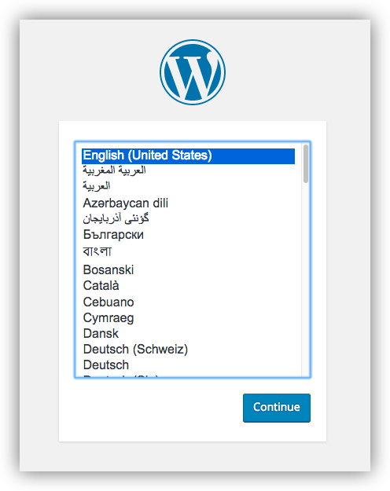
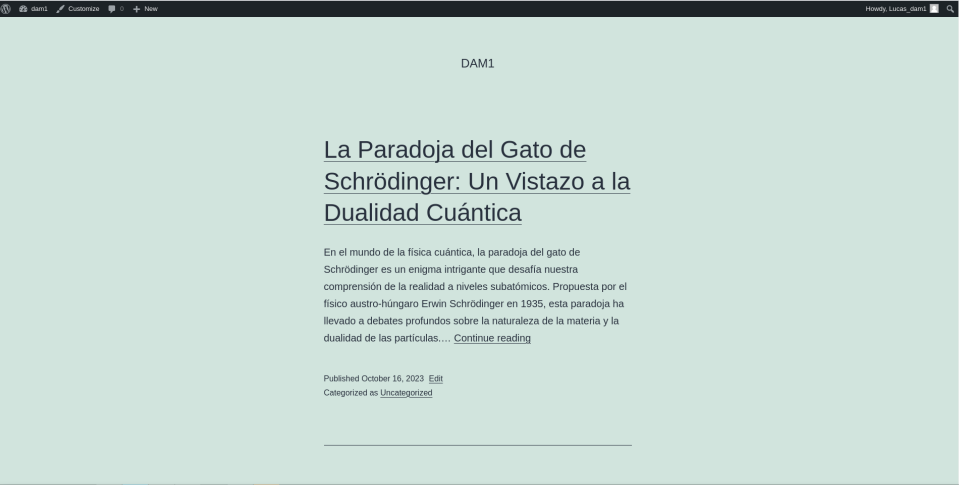
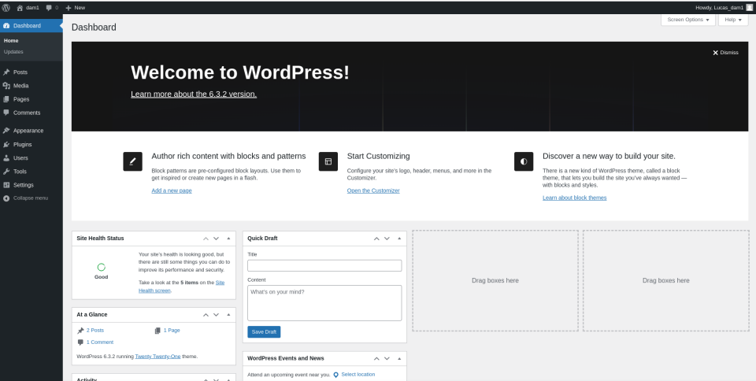

# Instalación de WordPress con Docker Compose

Este es un tutorial rápido para instalar WordPress utilizando Docker Compose.

## Requisitos previos

Asegúrate de tener Docker Compose instalado en tu sistema. Puedes encontrar instrucciones de instalación [aquí](https://docs.docker.com/compose/install/).

## Pasos

1. Crea un directorio para tu proyecto y accede a él.

2. Crea un archivo `docker-compose.yml` en ese directorio y añade el siguiente contenido:

   ```yaml
   services:
     db:
       image: mariadb:10.6.4-focal
       command: '--default-authentication-plugin=mysql_native_password'
       volumes:
         - db_data:/var/lib/mysql
       restart: always
       environment:
         - MYSQL_ROOT_PASSWORD=somewordpress
         - MYSQL_DATABASE=wordpress
         - MYSQL_USER=wordpress
         - MYSQL_PASSWORD=wordpress
       expose:
         - 3306
         - 33060
     wordpress:
       image: wordpress:latest
       volumes:
         - wp_data:/var/www/html
       ports:
         - 80:80
       restart: always
       environment:
         - WORDPRESS_DB_HOST=db
         - WORDPRESS_DB_USER=wordpress
         - WORDPRESS_DB_PASSWORD=wordpress
         - WORDPRESS_DB_NAME=wordpress
   volumes:
     db_data:
     wp_data:
     ```

**Encender el WordPress** 
    Ejecuta el comando ```docker compose up -d``` en el directorio de tu proyecto. Esto descargará las imágenes necesarias y lanzará los contenedores de WordPress y MariaDB.

 **WordPress en web**

 Abre tu navegador web y accede a http://localhost para completar la instalación de WordPress.

- Escoge el Idioma que prefieras.



- Regístrate con tu credenciales que te serviran para acceder al apartado de administrador.


**Apagar y limpiar**

 Para detener los contenedores puedes usar el siguiente comando ```docker compose down```

 ## Resultado de mi WordPress

 1. **Parte de cara al publico**
 

 2. **Parte de alministrador**
 
 